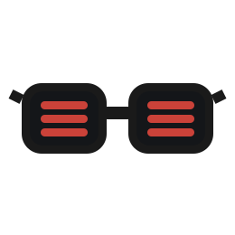

# &nbsp; Sage

Sage is a Redis and Valkey client for Scala 3. It implements the Redis protocol directly in Scala instead of wrapping a Java client.

- Choose the artifact for [ZIO](https://zio.dev), [Cats Effect](https://typelevel.org/cats-effect/), [Kyo](https://getkyo.io), [Ox](https://ox.softwaremill.com), or [Pekko](https://pekko.apache.org). Each artifact uses its ecosystem's native types.
- The core implements RESP3, commands, and codecs in Scala 3.
- Redis 8+ and Valkey 8+ support includes auto-pipelining, transactions, cluster routing, sharded pub/sub, client-side caching, rate limiting, distributed locks, and TLS.

Sage supports Scala 3.3.x LTS and later and requires JDK 21 or later.

### Consult the [Documentation](https://ghostdogpr.github.io/sage/) to learn how to use Sage.
